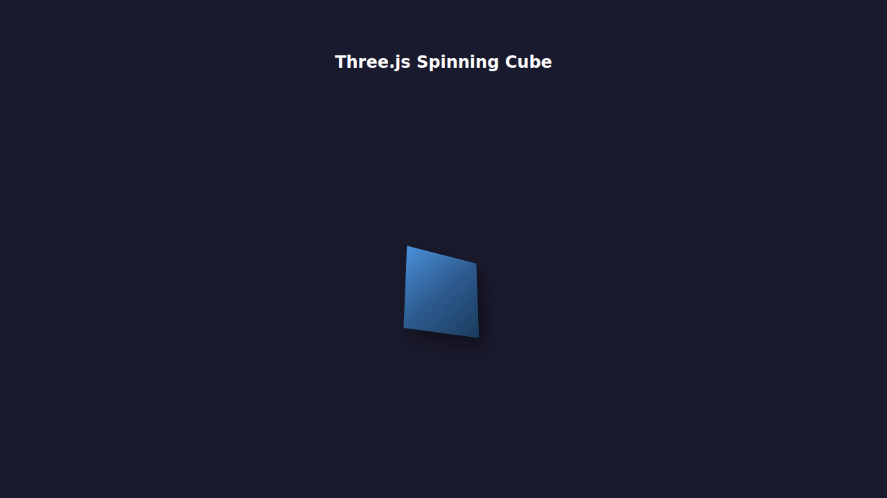

# React Three.js — Interactive 3D Scene

A Progressive Web App that renders three rotating 3D cubes using React, Three.js, TypeScript, Vite, and SCSS. Features a TikTok/Shorts-style swipable interface with smooth camera transitions, an FPS counter, and navigation dots. Statically hosted on GitHub Pages.

## Screenshot



## Live Demo

👉 [View on GitHub Pages](https://colinccook.github.io/throwaway-react-native-expo-threejs-cube/)

## Features

- **Full-screen canvas** — no white borders, scroll locked, pinch-zoom disabled  
- **Three rotating cubes** — each cube rotates at a slightly different speed  
- **FPS counter** — small monospace number in the top-left corner  
- **Three swipable camera views** (swipe up to advance, swipe down to go back):

| Page | View | Description |
|------|------|-------------|
| 0 | Side view *(default)* | Straight-on side view of all three cubes |
| 1 | Top view | Bird's-eye overhead view |
| 2 | Cube focus | Camera zooms to a cube; swipe **left/right** to move between cubes |

- **Page title overlay** — white text in the top-left corner showing the current view name; animates up/down with vertical swipes and left/right with horizontal swipes on the cube focus page  
- **Navigation dots** — three vertical dots on the right edge; the bottom dot has three horizontal sub-dots indicating left/right cube navigation  
- **Assertive, smooth camera tweening** — the camera follows your finger in real time; releasing mid-swipe snaps back or advances based on threshold  
- **SCSS styling** — global reset and component styles in `src/styles/`

## Tech Stack

- **React 19** with [Vite](https://vite.dev/) for fast development and optimized builds
- **Three.js** for WebGL 3D rendering
- **TypeScript** for type safety
- **SCSS** (via [sass](https://sass-lang.com/)) for styling
- **PWA** with web app manifest for installability
- **Jest** + [jest-cucumber](https://github.com/bencompton/jest-cucumber) for BDD testing
- **GitHub Actions** for CI/CD (test, build, deploy)
- **GitHub Pages** for static web hosting

## Project Structure

```
├── src/
│   ├── main.tsx                # React entry point (imports global.scss)
│   ├── App.tsx                 # Swipable interface, gesture handling, nav dots, FPS overlay
│   ├── components/
│   │   ├── ThreeScene.tsx      # Three.js scene: 3 cubes, camera views, FPS tracking
│   │   └── SpinningCube.tsx    # (legacy) Original single-cube component
│   ├── styles/
│   │   ├── global.scss         # CSS reset, overflow:hidden, touch-action:none
│   │   └── app.scss            # App layout, nav-dots, fps-counter, page-title styles
│   └── vite-env.d.ts           # Vite type declarations
├── public/
│   ├── favicon.png             # App icon
│   └── manifest.json           # PWA manifest
├── features/
│   └── spinning-cube.feature   # BDD feature file (Gherkin)
├── __tests__/
│   └── spinning-cube.steps.tsx  # BDD step definitions
├── __mocks__/
│   └── styleMock.js            # Jest mock for SCSS imports
├── .github/workflows/
│   ├── test.yml                # Run BDD tests on PRs
│   ├── build.yml               # Build web artifact
│   └── deploy-pages.yml        # Deploy web build to GitHub Pages
├── index.html                  # Vite HTML entry point (viewport: no-zoom)
├── vite.config.ts              # Vite configuration
├── tsconfig.json               # TypeScript configuration
└── jest.config.cjs             # Jest configuration (scss moduleNameMapper)
```

## Getting Started

### Prerequisites

- Node.js 20+
- npm

### Install Dependencies

```bash
npm install
```

### Run Locally

```bash
npm run dev
```

### Run Tests

```bash
npm test
```

### Build for Production

```bash
npm run build
```

The output is written to the `dist/` directory.

### Preview Production Build

```bash
npm run preview
```

## CI/CD Pipelines

| Workflow | Trigger | Description |
|----------|---------|-------------|
| **Test** | Pull requests to `main` | Runs BDD tests |
| **Build** | Push to `main` + PRs | Builds web bundle |
| **Deploy Pages** | Push to `main` | Deploys web build to GitHub Pages |

## BDD Tests

Tests are written in Gherkin syntax (`features/spinning-cube.feature`) with step definitions in `__tests__/spinning-cube.steps.tsx`.

```gherkin
Feature: Three Rotating Cubes with Swipable Views

  Scenario: The three-scene canvas fills the entire screen
  Scenario: An FPS counter is visible in the top-left corner
  Scenario: Navigation dots are visible on the right
  Scenario: There are exactly 3 vertical navigation dots
  Scenario: The default view is the side view
  Scenario: Swiping up advances to the top view
  Scenario: The horizontal sub-dots are visible after the app loads
  Scenario: The page title overlay is visible
  Scenario: The horizontal sub-dots are rendered in reversed order
```

## Instructions for Future Prompting

> **Always update documentation and BDD tests with each prompt. Add clear screenshots to `docs/` where applicable.**

When extending this project, keep the following in mind:

### Camera Views

The `ThreeScene` component accepts `verticalTRef` (0–2) and `horizontalTRef` (0–2) as `MutableRefObject<number>`. The render loop reads these refs every frame and smoothly lerps the camera:

| `verticalTRef` | Camera |
|---|---|
| 0 | Side view (default) |
| 1 | Top view |
| 2 + `horizontalTRef` (0–2) | Focus on cube 0/1/2 |

### Adding New 3D Objects

- Create new components in `src/components/` following the pattern in `ThreeScene.tsx`
- Use Three.js `WebGLRenderer` directly — no wrapper libraries needed
- Add a `data-testid` attribute to the container `<div>` for testability

### Adding New BDD Tests

- Write `.feature` files in the `features/` directory using Gherkin syntax
- Write corresponding `.steps.tsx` files in `__tests__/`
- Mock `three` in tests since WebGL is not available in the jsdom test environment
- Mock SCSS imports using `__mocks__/styleMock.js` (configured via `moduleNameMapper` in `jest.config.cjs`)
- Use `@testing-library/react` with `jest-environment-jsdom` for DOM-based testing

### Modifying the App Layout

- `src/App.tsx` owns gesture detection, page state, FPS overlay, and navigation dots
- `src/styles/app.scss` contains all UI chrome styles (nav dots, fps counter)
- `src/styles/global.scss` contains the full-screen reset and touch-action rules

### Dependency Notes

- No `--legacy-peer-deps` needed; all dependencies resolve cleanly
- Use `npm install <package>` to add new dependencies
- SCSS is compiled by the `sass` dev dependency via Vite's built-in preprocessor support

### GitHub Pages

- The web build is deployed from the `dist/` directory
- Vite's `base` option is set to the repository name for correct asset paths
- The deployment workflow runs on push to `main`
- Ensure GitHub Pages is enabled in repository settings (Settings → Pages → Source: GitHub Actions)

